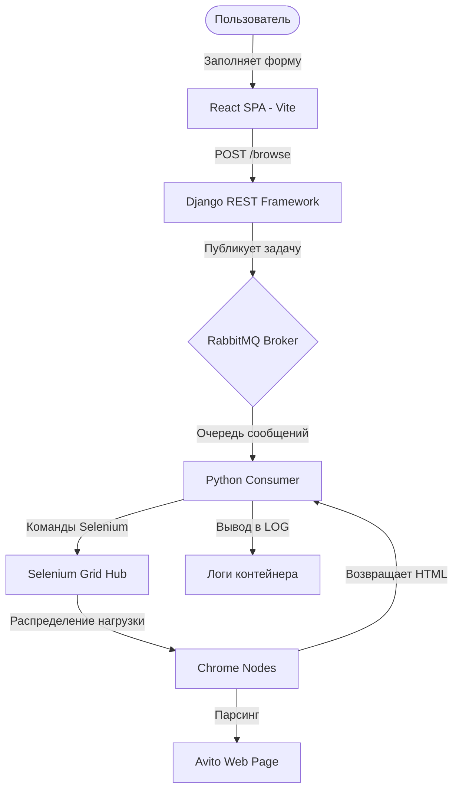

# Сервис объявлений о недвижимости с асинхронным парсером Авито

Этот проект представляет собой полноценное отказоустойчивое решение для создания объявлений о недвижимости и асинхронного сбора данных (парсинга) с использованием распределенной очереди.

Проект разработан в рамках тестового задания и реализован в соответствии с лучшими практиками **Middle+/Senior** разработки: строгая архитектура **FSD (Feature-Sliced Design)**, модульные стили **SCSS**, асинхронная архитектура очередей и оркестрация инфраструктуры через **Docker Compose**.

---

## 🏗️ Архитектура системы

Вся система спроектирована как слабосвязанная (decoupled) событийно-ориентированная архитектура:



### Преимущества архитектуры:
1. **Неблокирующий UI**: Пользователь мгновенно получает ответ `status: "queued"`. Тяжелые операции парсинга Авито (запуск браузера, сетевые ожидания, рендеринг JS) происходят асинхронно в фоне.
2. **Безопасность портов**: Внешний доступ имеет только бэкенд на порту `8000`. Очередь RabbitMQ и кластер Selenium Grid полностью скрыты внутри изолированной Docker-сети.
3. **Отказоустойчивость**: Consumer имеет автоматический механизм переподключения (10 попыток с задержкой) на случай задержки старта RabbitMQ. Сервисы в Docker запускаются строго после успешного прохождения проверок здоровья (`healthcheck`) зависимых контейнеров.

---

## 🛠️ Стек технологий

### Frontend
* **Core**: React 19, TypeScript
* **State & Forms**: Formik (связывание инпутов через кастомный HOC `createFormField`), React Query (TanStack Query v5)
* **Validation**: Yup (с кастомным правилом `.moreThanSumOfFields`)
* **Styling**: SCSS Modules (модульные стили с использованием локальных пространств имен и вложенности)
* **Build Tool**: Vite

### Backend & Queue
* **API Service**: Python, Django REST Framework (DRF)
* **Message Broker**: RabbitMQ
* **Worker & Automation**: Python, Pika, Selenium Webdriver
* **Browser Cluster**: Selenium Grid (Hub + Chrome Nodes)
* **Orchestration**: Docker, Docker Compose

---

## 📁 Структура проекта (Фронтенд по методологии FSD)

Фронтенд структурирован по строгой методологии **Feature-Sliced Design**:

```text
frontend/src/
├── app/
│   ├── styles/               # Глобальные стили (index.scss, App.scss)
│   └── App.tsx               # Запуск приложения (рендерит строго слой Page)
├── pages/
│   └── property-form-page/   # Слой страниц
│       ├── index.ts          # Public API страницы
│       ├── property-form-page.module.scss
│       └── property-form-page.tsx
├── features/
│   └── property-form/        # Фича создания формы объявления
│       ├── api/              # API-интеграция (property-api.ts, хук usePropertyMutation.ts)
│       ├── index.ts          # Public API фичи
│       ├── property-form.constants.ts
│       ├── property-form.schema.ts
│       ├── property-form.type.ts
│       ├── property-form.module.scss
│       └── property-form.tsx # Компонент формы
└── shared/                   # Переиспользуемые хелперы, UI-компоненты
    ├── api/                  # Общий транспортный клиент Axios
    ├── lib/                  # Общие обертки (Formik HOC, Yup-инициализация)
    └── ui/                   # Базовые UI-компоненты (Input, Checkbox, Radio)
```

---

## 🚀 Быстрый запуск

### Требования
* Установленный [Docker Desktop](https://www.docker.com/products/docker-desktop/)
* Установленный [Node.js](https://nodejs.org/) (версии 18+)

### Шаг 1. Запуск инфраструктуры (Docker)
В корневой папке проекта выполните команду для сборки и запуска контейнеров:
```bash
docker-compose up --build
```
*Команда запустит базу данных, RabbitMQ, Selenium Grid с нодой Chrome, Django API и фонового воркера-консьюмера.*

### Шаг 2. Запуск фронтенда
В новом терминале перейдите в папку `frontend`, установите зависимости и запустите сервер разработки Vite:
```bash
cd frontend
npm install
npm run dev -- --host
```
*Флаг `--host` позволяет Vite автоматически прослушивать все сетевые интерфейсы, включая виртуальные адаптеры VPN.*

Откройте в браузере предоставленную ссылку (по умолчанию **`http://localhost:5173`**).

---

## 🧪 Сценарии тестирования

### 1. Тест валидации бизнес-логики (Yup + Formik)
* **Валидация этажности**:
  * Введите в поле *«Всего этажей»* значение `10`.
  * Введите в поле *«Этаж»* значение `12`.
  * *Результат*: Вы увидите локальную ошибку: `Значение не может быть больше количества этажей в доме`.
* **Кастомное правило площадей (`moreThanSumOfFields`)**:
  * Задайте *«Жилая площадь»* = `30`, *«Площадь кухни»* = `15` (сумма = 45).
  * Введите в *«Общая площадь»* значение `40`.
  * *Результат*: Появится динамическая ошибка: `Общая площадь должна быть больше суммы жилой площади и площади кухни`. При увеличении общей площади до `50` ошибка мгновенно пропадет.

### 2. Тест асинхронного парсинга Авито
1. Заполните все поля формы валидными значениями.
2. В поле *«Ссылка на объявление Авито»* введите реальную ссылку на объявление Авито.
3. Нажмите кнопку **«Опубликовать объявление»**.
4. Форма сбросится, и появится зеленый баннер успешной постановки задачи в очередь.
5. Откройте терминал, где запущен Docker Compose, или введите команду:
   ```bash
   docker-compose logs consumer
   ```
   *Вы увидите лог выполнения задачи: запуск Chrome, переход по ссылке и полный вывод исходного HTML-кода страницы Авито прямо в логи консоли.*
